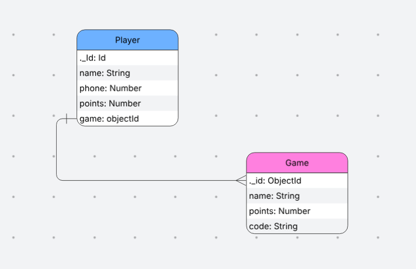

# Park Points
## Date: 20/10/2025

### By:
### | [balqees](https://github.com/balqeesalawi)
### | [naser](https://github.com/envwx)
***
## ERD
### | 
### | [Figma Link](https://www.figma.com/design/yj28ybIrX5at2NiG4nmslp/Untitled?node-id=1-2&p=f&t=Yi9ns33k8fgLVimz-0)
***
### ***Description***

#### park Points, a website based off a park theme where you can explore a lot of fun games, earn points and can stack them up so by the end of the day you can take all of your points and trade them for cool prizes!
***

### ***Technologies used in our project***
* javascript
* vite
* html
* JSX
* CSS
* Routes
* controllers
* modules
* APIs
* MongooseDB
* axios
* react
* react-dom
* react-router-dom
* insomnia

***

# Featuring in the project

* Games list
* home page
* player page
* player points
* welcome page
* game details
* sign up with phone number and user
***
# Unresolved problems
* not yet detected
***
## ***Project Preview***

## park Points, a website based off a park theme where you can explore a lot of fun games, earn points and can stack them up so by the end of the day you can take all of your points and trade them for cool prizes!

***

***

